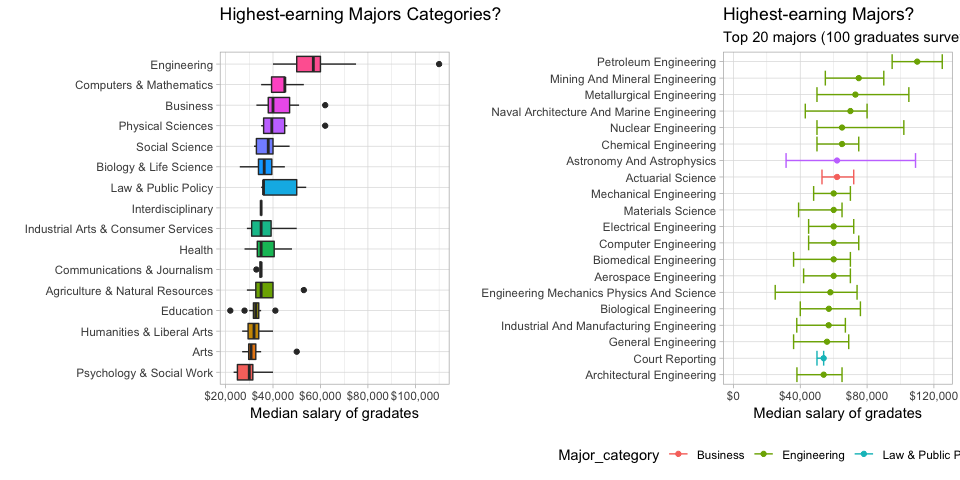

## Reproducing David Robinson’s [Work](https://github.com/dgrtwo/data-screencasts/blob/master/college-majors.Rmd)

#### Load library

``` r
library(tidyverse)
library(ggthemes)
library(scales)
library(patchwork)
theme_set(theme_light())
```

#### Read in Data

``` r
dataDir <- "https://raw.githubusercontent.com/rfordatascience/tidytuesday/master/data/2018-10-16/recent-grads.csv"
major_df <- read_csv(dataDir) %>% 
  arrange(desc(Median)) %>% 
  mutate(Major = str_to_title(Major),
         Major = fct_reorder(Major, Median))
```

### Women share by `Major_category`

``` r
major_gender <- major_df %>% 
  drop_na() %>% 
  group_by(Major_category) %>% 
#  summarise_at(vars(Men, Women, Total), sum) %>% 
  summarise(Men = sum(Men),
            Women = sum(Women),
            Total = sum(Total),
            Median = sum(Median * Sample_size / sum(Sample_size)) # Weighted
            ) %>% 
  mutate(ShareWomen = Women / Total) %>% 
  arrange(desc(ShareWomen)) 

g1 <- major_gender %>% 
  ggplot(aes(fct_reorder(Major_category, ShareWomen), ShareWomen)) +
  geom_col(aes(fill = ShareWomen)) + 
  coord_flip() +
  theme(legend.position = "none") +
  labs(title = "Share of Women in Major Categories",
       y = "Share of Women",
       x = "Major Categories") 

g2 <- major_df %>%
  arrange(desc(Total)) %>%
  head(20) %>%
  mutate(Major = fct_reorder(Major, Total)) %>%
  gather(Gender, Number, Men, Women) %>%
  ggplot(aes(Major, Number, fill = Gender)) +
  geom_col() + 
  scale_y_continuous(labels = comma_format()) +
  coord_flip() +
  labs(title = "Gender Breakdown in Top 20 Majors",
       y = "Number of Graduates",
       x = "Majors") 
    
g1 + g2 + plot_layout(ncol = 2)
```

<!-- -->

### Highest-earning `Major_category` and `Major`

``` r
p1 <- major_df %>% 
  mutate(Major_category = fct_reorder(Major_category, Median)) %>% 
  ggplot(aes(Major_category, Median, fill = Major_category)) +
  geom_boxplot() +
  scale_y_continuous(labels = dollar_format())+
  coord_flip() +
  labs(title = "Highest-earning Majors Categories?",
       subtitle = " ",
       x = "",
       y = "Median salary of gradates") +
  theme(legend.position = "none")

p2 <- major_df %>% 
  head(20) %>% 
  ggplot(aes(Major, Median, color = Major_category)) +
  geom_point() +
  geom_errorbar(aes(ymin = P25th, ymax = P75th)) +
  expand_limits(y = 0) +
  scale_y_continuous(labels = dollar_format()) +
  coord_flip() +
  labs(title = "Highest-earning Majors?",
       subtitle = "Top 20 majors (100 graduates surveyed). Bars represent the 25th to 75th percentile.",
       x = "",
       y = "Median salary of gradates") +
  theme(legend.position = "bottom")

p1 + p2 + plot_layout(ncol = 2)
```

<!-- -->

### Major vs ShareWomen

``` r
library(ggrepel)
major_gender %>%
#  mutate(Major_category = fct_lump(Major_category, 6)) %>%
  ggplot(aes(ShareWomen, Median)) +
  geom_point() +
  geom_smooth(method = "lm") +
  geom_text_repel(aes(label = Major_category), force = .2) +
  expand_limits(y = 0) +
  NULL
```

<!-- -->

``` r
library(plotly)
g <- major_df%>%
  mutate(Major_category = fct_lump(Major_category, 4)) %>%
  ggplot(aes(ShareWomen, Median, 
             color = Major_category, size = Sample_size, label = Major)) +
  geom_point() +
  geom_smooth(aes(group = 1), method = "lm") +
  scale_x_continuous(labels = percent_format()) +
  scale_y_continuous(labels = dollar_format()) +
  expand_limits(y = 0)
# ggplotly(g) # Not supported by GitHub
```
