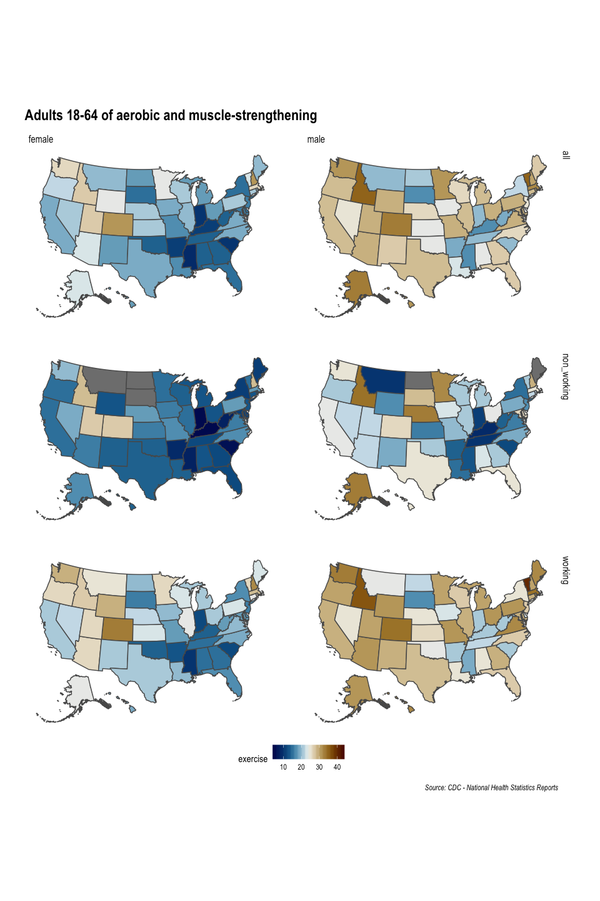

#### Load library

``` r
library(tidyverse)
library(readxl)
library(ggthemes)
```

#### Read in Data

``` r
file16    <- "../data/week16_exercise.xlsx"
excel_sheets(file16)
```

    ## [1] "source" "tidy"

``` r
source_df <- read_xlsx(file16, 1)
tidy_df   <- read_xlsx(file16, 2) %>% mutate(exercise = as.numeric(exercise))
```

##### US State Maps

``` r
#ggplot() + geom_sf(data = world1)
conus    <- rnaturalearth::ne_download(scale = 110,
                                       type = "states",
                                       category = "cultural",
                                       destdir = tempdir(),
                                       load = TRUE,
                                       returnclass = "sf") %>% 
  filter(!postal %in% c("HI", "AK")) %>% 
  select(woe_name, postal, region, region_sub, geometry)
```

    ## OGR data source with driver: ESRI Shapefile 
    ## Source: "/private/var/folders/5z/0c4j3v1s5tn2wzgy_t7b58lw0000gn/T/RtmpIX16E1", layer: "ne_110m_admin_1_states_provinces_lakes"
    ## with 51 features
    ## It has 83 fields
    ## Integer64 fields read as strings:  ne_id

#### US State Maps with Hawaii and Alaska adjusted

``` r
library(albersusa)
usmap <- usa_sf("laea")%>% 
  mutate(st = iso_3166_2) %>% 
  select(name, st, geometry)
work_sf <- inner_join(tidy_df, usmap, by = c("state" = "name")) 
```

    ## Warning: Column `state`/`name` joining character vector and factor,
    ## coercing into character vector

#### Join

``` r
library(scico)
library(hrbrthemes)
p <- work_sf %>% 
  filter(sex != "both") %>% 
  ggplot() +
  geom_sf(aes(fill = exercise)) +
# https://github.com/tidyverse/ggplot2/issues/2071
  coord_sf(datum = NA) +  # no graticules
  scale_fill_scico(palette = "vik", na.value = "grey50") +
  facet_grid(work_status ~ sex) +
  theme_ipsum() + 
  theme(axis.title = element_blank(),
        axis.text = element_blank(),
        panel.grid = element_blank(),
        legend.position = "bottom") +
  labs(title = "Adults 18-64 of aerobic and muscle-strengthening",
       caption = "Source: CDC - National Health Statistics Reports"  )+
  NULL
p
```

<!-- -->

``` r
ggsave("exercise.png", p, dpi = 300)
```

    ## Saving 10 x 15 in image
