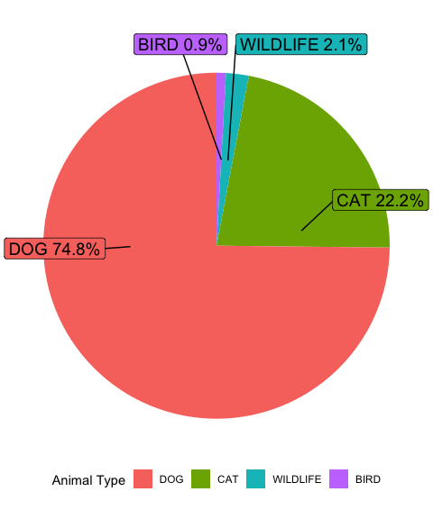

#### Load library

``` r
library(tidyverse)
library(readxl)
library(ggthemes)
```

#### Read in Data

``` r
raw_df <- read_excel("../data/week18_dallas_animals.xlsx")
```

``` r
dist_df <- raw_df %>% 
  group_by(council_district)
```

# Pie Chart

[Adding percentage labels on pie chart in
R](https://stackoverflow.com/a/41340766/9421451) from StackOverflow.

``` r
library(ggrepel)
library(scales)
pie <- raw_df %>% 
  count(animal_type) %>% 
  mutate(perc = percent(n/sum(n))) %>% 
  arrange(desc(n)) %>% 
  filter(animal_type != "LIVESTOCK") %>% 
  ggplot(aes(x = "", y = n, fill = fct_reorder(animal_type, desc(n)))) +
  geom_bar(width = 1, stat = "identity") + 
  coord_polar(theta = "y") +
# https://stackoverflow.com/a/41340766/9421451
  geom_label_repel(aes(label = paste0(animal_type, " ", perc)), 
                   size = 5, show.legend = F, nudge_x = 1) +
  theme_void() +
  theme(legend.position = "bottom") +
  labs(y = NULL,
       fill = "Animal Type")
pie
```

<!-- -->

``` r
ggsave("pie.png", pie, dpi = 300)
```
