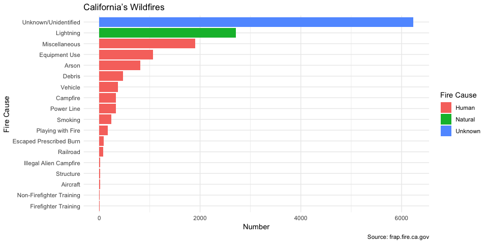
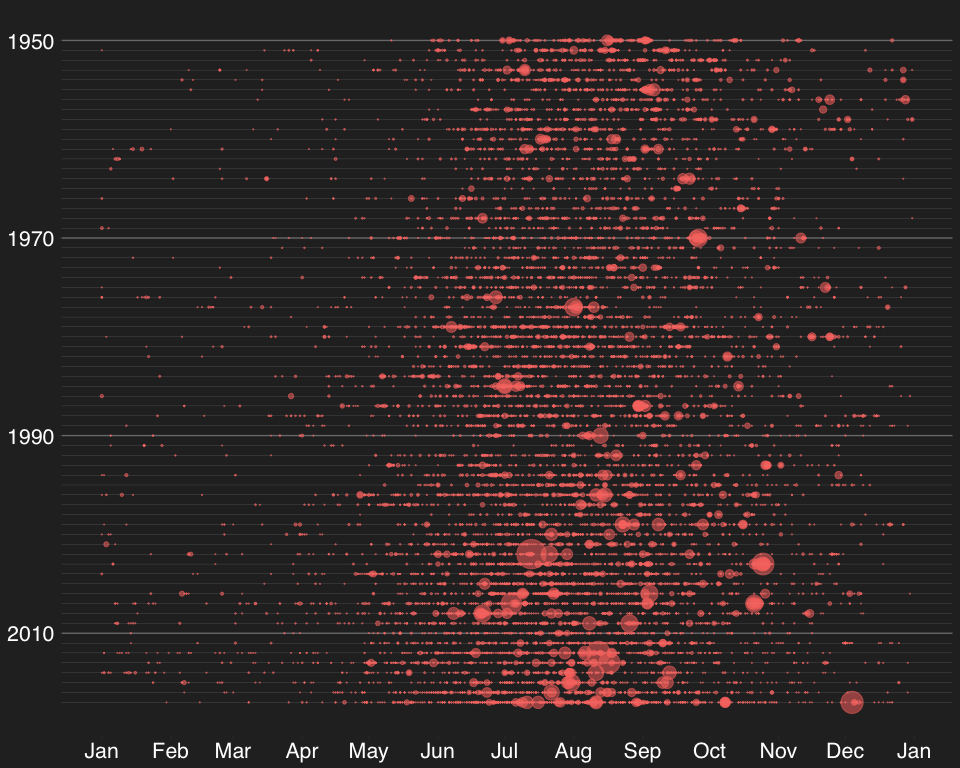
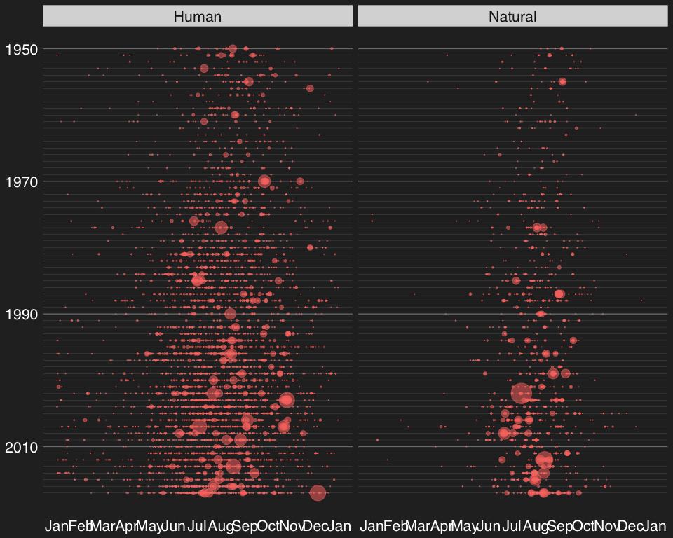

#### Load library

``` r
library(tidyverse)
library(magrittr)
library(ggthemes)
```

#### Read in Data

``` r
raw_df <- read_csv("../data/2018-08-21/week21_calfire_frap.csv")
```

#### Scrape the table from website

Cause coding: [Cause Code
Description](http://frap.fire.ca.gov/projects/fire_data/fire_perimeters_data_description)

``` r
library(rvest)
raw_web <- read_html("http://frap.fire.ca.gov/projects/fire_data/fire_perimeters_data_description")

fire_cause <- raw_web %>% 
  html_nodes("table") %>% 
  extract2(5) %>% 
  html_table(header = T) %>% 
  rename(cause = `Cause Code`)
```

``` r
library(forcats)
fire_df <- left_join(raw_df, fire_cause) %>% 
  mutate(Description = if_else(is.na(cause), 
                               "Unknown/Unidentified", 
                               Description))
```

    ## Joining, by = "cause"

``` r
p1 <- fire_df %>% 
  count(Description, fire_cause) %>% 
  arrange(desc(n)) %>% 
  ggplot(aes(x = fct_reorder(Description, n), y = n, fill = fire_cause)) +
  geom_bar(stat = "identity") +
  coord_flip() + 
  theme_minimal() +
  labs(title = "California’s Wildfires",
       y = "Number",
       x = "Fire Cause",
       caption = "Source: frap.fire.ca.gov") +
  guides(fill = guide_legend(title = "Fire Cause")) +
  NULL
p1
```

<!-- -->

> Modified from
> [BuzzFeedNews/2018-07-wildfire-trends](https://github.com/BuzzFeedNews/2018-07-wildfire-trends/blob/master/index.Rmd)
> by [Peter Aldhous](https://github.com/paldhous)

``` r
cause_pal <- c("#ffff00","#d397fc","#ffffff")
p2 <- fire_df %>% 
  ggplot() +
  geom_point(aes(x = plot_date, y = year_, size = gis_acres, 
                 color="#ffa500", alpha = 0.7)) +
  geom_hline(yintercept = seq(1950, 2017, by = 1), color = "gray", size = 0.05) +
  scale_size_area(max_size = 10, guide = FALSE) +
  scale_x_date(date_breaks = "months", date_labels = "%b") +
  scale_y_reverse(limits = c(2017, 1950), breaks = c(2010, 1990, 1970, 1950)) +
  labs(x = NULL, y = NULL) +
  theme_hc(style = "darkunica", base_size = 20) +
  theme(axis.text = element_text(color = "#ffffff")) + 
  theme(legend.position = "none") +
  NULL
p2
```

    ## Warning: Removed 1623 rows containing missing values (geom_point).

<!-- -->

#### two panels

``` r
cause_pal <- c("#ffff00","#d397fc","#ffffff")
p3 <- fire_df %>% 
  filter(fire_cause != "Unknown") %>% 
  ggplot() +
  geom_point(aes(x = plot_date, y = year_, size = gis_acres, 
                 color="#ffa500", alpha = 0.7)) +
  geom_hline(yintercept = seq(1950, 2017, by = 1), color = "gray", size = 0.05) +
  scale_size_area(max_size = 10, guide = FALSE) +
  scale_x_date(date_breaks = "months", date_labels = "%b") +
  scale_y_reverse(limits = c(2017, 1950), breaks = c(2010, 1990, 1970, 1950)) +
  labs(x = NULL, y = NULL) +
  theme_hc(style = "darkunica", base_size = 20) +
  theme(axis.text = element_text(color = "#ffffff")) + 
  theme(legend.position = "none") +
  facet_wrap(fire_cause ~.) +
  NULL
p3
```

    ## Warning: Removed 714 rows containing missing values (geom_point).

<!-- -->

#### `gganimate`
